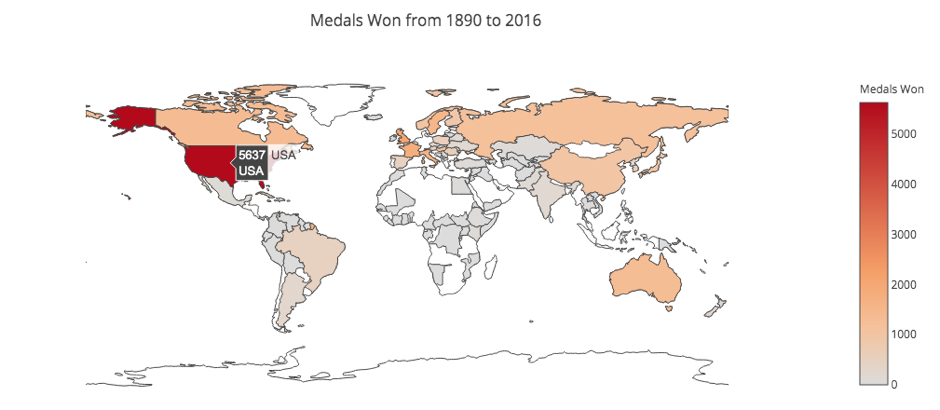
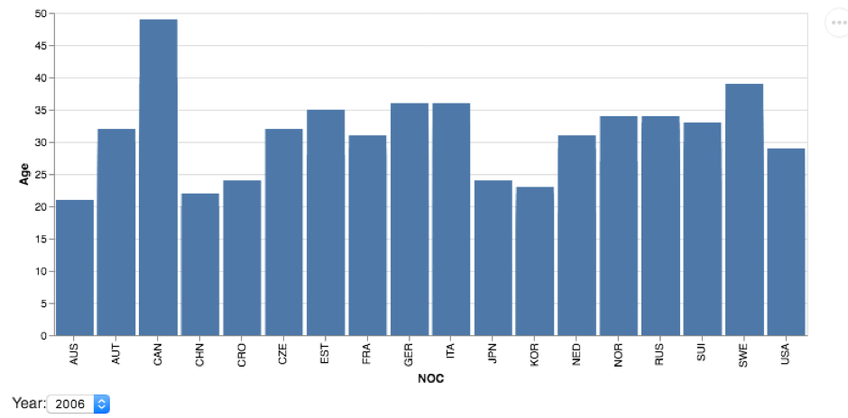
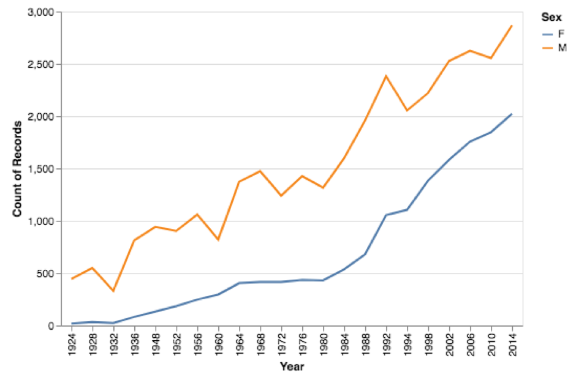
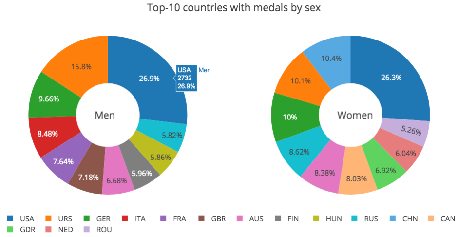
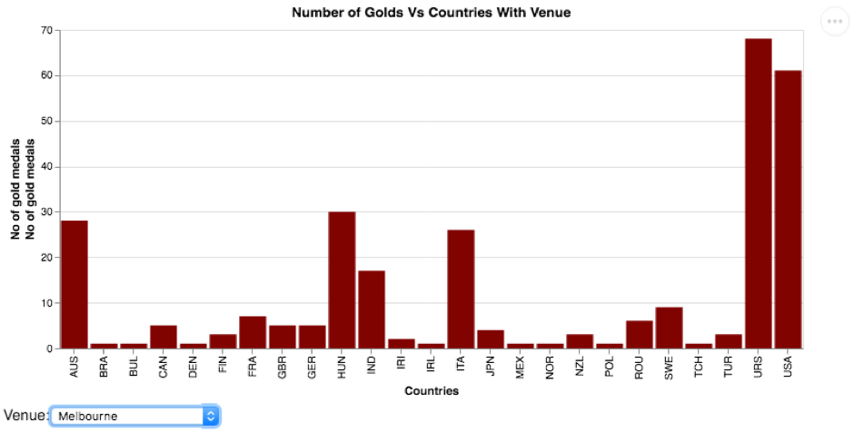
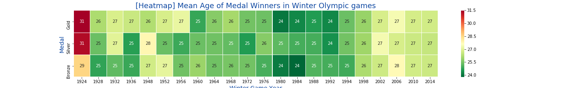
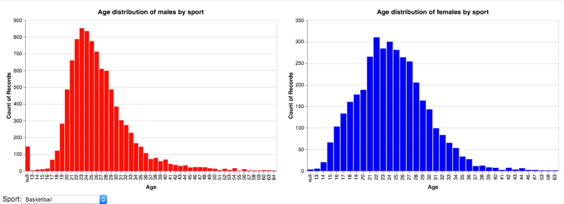

# Team name: AbnormalDistribution
   
 
## Team members:
- Tejaswini Rajendra Kale(10514273)
- Eldho John Paul(10517084)
- Antony Joseph Thoppil(10519069)
  
 
## Dataset
120 years of Olympic history: athletes and results
(https://www.kaggle.com/heesoo37/120-years-of-olympic-history-athletes-and-results)
  
 
## The Visualisation
This visualisation aims to effectively showcase the Olympic Gold Medalists.
It is an interactive map with four plots.
- Plot 1: Gold Medal Distribution by Sport
- Plot 2: Age Distribution
- Plot 3: Physical attributes of Females
- Plot 4: Physical attributes of Males

# Goto http://thoppil.me/AbnormalDistribution/ for the final visualisation.
- Move mouse over plot 1 to get visualise data by Sport.
- Use `Shift` while moving mouse to visualise combination of sports.
- Use the dropdown menu to chose top 25 countries with most gold medals
- Double click empty area of plot 1 to reset the location filter.

  
  

## Preliminary Data Exploration and Comments by Team Members

The notebooks and plots are uploaded.

## Tejaswini Rajendra Kale

### Data exploration - Plots
#### Geographic Map : Medals won by countries from 1890 to 2016
 
 ##### Result
- Map represents total nuber of medals won by diffrent countries form 1890 to 2016.
- USA has won maximum number of medals 5637 followed by Canada with 1352 and third number in getting highest medal is Austarlia 1320
- Some countries did win only 1 medal such as Gabon where as some countris did not win any

#### Bar Plot : Age of winners on year selection
 
 ##### Result
 - Plot represents mean age of winners with country from above two graphs we can annalyse that countries with less mean age have   winned high number of medals. This plot is interactive can check with each year difference in mean age of winners
 
#### Line Graph : Males and Females participating in olympic over years
 
 ##### Result
 - It is visible from graph that till 1924 there was very less pticiption for female where as with development there is growth in number of females participating in olympic.
 - Gap between number of females and males participated is almost same over yeras
 
#### Donut Pie Chart : Top 10 countries with medals by sex
 
 ##### Result
  - USA has highest number of male and female medal winners.
 - Where as countries like united kindom and Finland have great apperiance in male catagory and does not show that great -participation in female catagory
 - China is only country which is among top 10 medal winner in femal catagory who does not come in top 10 for male catagory
 
#### Bar Plot : Countries with gold medalist when olymic held on selected venue
 
 ##### Result
  - Plot represents number of gold medals won by countries when held on selecteded venue. From this graph we can analyse which country performed well in which city
 
#### Heat Map : Mean Age of Medal Winner
 
 ##### Result
 - This heat map represents mean age of Medal winners with year from visualization it is understandable that from 1964 to 1994 mean age of winner was less than 25 where as on both ends of map mean age high .
 - It can be observerd that most of the gold medalist are experienced than brownze medalist player

#### Bar Plot : Age distibution of male and females by sport
 
 ##### Result
 - Plot represents age distribution of male and females depending on sport selection. From this graph we can analyse which age group have more participants in diffeent sports. For swimming age group 19 to 24 have maximum participants where as for femals it is 16 to 23

## Eldho John Paul

Data exploration - plots
- Distribution of height of all athletes
- variation in Height over year for Female Lifters
- Women medals per edition of the Games
- Variation of Age for Male Athletes over time

## Antony Joseph Thoppil

The data exploration and sample visualisations notebook is uploaded at /10519069. 
The following were plotted after examining the data.
- Age Distribution of Gold Medals
- Sports in which over 50 and under 15 got Gold
- Women in olympics
- Height Weight of Gold medalists
- Height vs weight over the years by age of US gold medalists and sports which won the gold
- Gold medalists over the years by country
